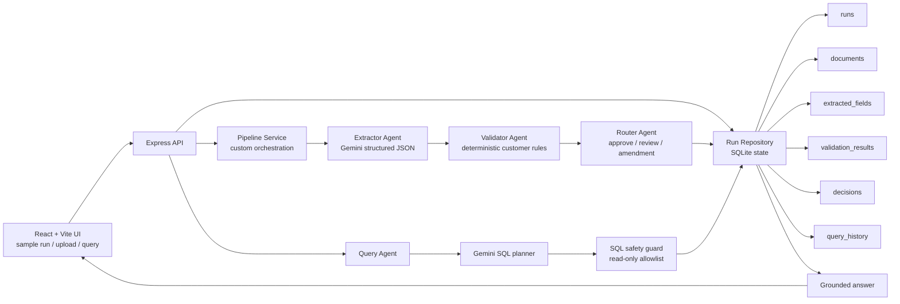

# Technical Write-Up

This write-up explains the engineering decisions behind the Part 1 POC: how data flows, where state lives, how the system fails safely, and what I would harden next.

## 1. Architecture Diagram



State lives in SQLite. The important persisted records are the run status, document metadata, raw extraction JSON, normalized extracted fields, validation rows, router decision, amendment draft, and query history. The agents do not rely on hidden shared memory. They hand off typed JSON objects: `ExtractionResult` -> `ValidationSummary` -> `DecisionResult`.

## 2. Three Nasty Failure Modes

### Failure Mode 1: Bad document quality creates missing fields

Real example from testing:
The messy commercial invoice intentionally has missing or unclear Incoterms. The extractor may return `null` or low confidence for `incoterms`.

Why it is dangerous:
If the system guesses the value, it could approve a shipment without evidence.

Current handling:
Each extracted field must include `value`, `confidence`, and `evidence`. The validator marks missing or confidence `< 0.75` fields as `uncertain`. Because Incoterms is a critical field in `customer-rules.json`, the router does not auto-approve the run. It routes the case to amendment/review.

### Failure Mode 2: A plausible-looking critical mismatch slips through

Real example from testing:
The messy invoice uses values like `Atlas Retail Imports Pvt Ltd`, wrong HS code, and different gross weight. These look close to valid trade fields, but they conflict with the Atlas Retail India rules.

Why it is dangerous:
The document is not blank or obviously broken, so a weak system may treat it as valid. In real operations, that could create wrong-party, customs, or shipment-delay risk.

Current handling:
The validator does deterministic comparison against configured customer rules. Critical mismatches in consignee, HS code, Incoterms, ports, or gross weight force `draft_amendment`. The router generates an amendment draft with found vs expected values instead of burying the discrepancy in generic text.

### Failure Mode 3: The query agent generates unsafe or ungrounded SQL

Real example from testing:
The backend tests now explicitly reject unsafe plans such as `DELETE FROM runs` and queries against disallowed tables like `users`.

Why it is dangerous:
Natural-language query is useful, but an LLM should not be trusted to directly execute database operations.

Current handling:
The query agent only proposes a SQL plan. The backend validates that the SQL is a single read-only `SELECT`, blocks forbidden keywords, allowlists tables, appends `LIMIT 20` for row-listing queries, executes the query itself, and summarizes only returned rows.

## 3. Observability For 50 Customers

For production, every shipment should get a stable `trace_id` at intake. If the input starts from email, the email ingestion service should attach the same `trace_id` to the email, attachment, document row, pipeline run, model request, validation result, routing decision, and final verified output.

Trace path:

```txt
email_received -> attachment_saved -> run_created -> extraction_started
-> extraction_completed -> validation_completed -> routing_completed
-> human_review_completed or auto_approved
```

What I would log per stage:

- `trace_id`, `customer_id`, `shipment_id`, `document_id`, `run_id`
- stage name and status
- model name and token usage
- latency in milliseconds
- retry count
- confidence summary
- decision outcome
- error code and safe error message

Production dashboard:

- completed runs by customer and document type
- stuck runs by stage
- extraction latency p50/p95/p99
- extraction failure rate
- critical mismatch rate
- auto-approval rate
- human-review queue size and age
- amendment draft acceptance rate
- cost per customer and cost per document
- top failing fields, such as Incoterms or gross weight

This would let an operator search one shipment and see exactly where it is, while leadership sees whether Nova is reducing review time without increasing critical escapes.

## 4. Cost Per Document

Using current Gemini 2.5 Flash public pricing as the rough baseline: input is about `$0.30 / 1M` text/image/video tokens and output is about `$2.50 / 1M` tokens.

Back-of-envelope for one normal document:

```txt
Extraction input: 8,000 tokens  * $0.30 / 1M = $0.0024
Extraction output: 1,000 tokens * $2.50 / 1M = $0.0025
Query input:      2,000 tokens  * $0.30 / 1M = $0.0006
Query output:       500 tokens  * $2.50 / 1M = $0.00125

Approx total for one document plus one query: ~$0.00675
```

This is only an estimate. The real implementation should store model usage metadata per run and calculate actual cost from provider billing units.

Where cost blows up:

- long multi-page PDFs
- repeated retries on poor scans
- using the strongest model for every document
- letting the query agent return too many rows
- asking the model to reason over full raw JSON repeatedly

Cost controls:

- cap file size and page count
- one extraction attempt in the POC, bounded retries in production
- route simple text-only query summarization to a cheaper model
- cache extracted results by document hash
- store normalized rows so queries do not need full raw extraction JSON
- enforce SQL `LIMIT` and response token limits

## 5. Latency

Slowest hop:
The extraction call is the slowest hop because Gemini must process a PDF/image and return structured JSON. Validation, routing, SQLite writes, and SQL execution are comparatively small local operations.

Expected latency shape:

```txt
Upload and metadata save: low milliseconds
Gemini extraction: seconds
Validation: low milliseconds
Routing: low milliseconds
SQLite persistence: low milliseconds
Query planning + summarization: usually sub-extraction, but still model-bound
```

How I would improve latency:

- split large PDFs into pages and process only relevant pages first
- use document-type detection to choose a tighter prompt
- run extraction asynchronously and show pipeline state in the UI
- cache repeated document hashes
- use a cheaper/faster model for query summarization
- collect p95 latency per stage before optimizing anything else

## 6. What I Would Do Differently With A Week

With a week instead of a day, I would spend most of it on reliability and evals rather than adding more agents.

1. Build a real eval harness with labeled clean, messy, and low-quality documents.
2. Add step-level persistence with `pipeline_steps` so runs can resume after a crash.
3. Add model usage logging so cost per document is measured instead of estimated.
4. Add side-by-side evidence review in the UI so CG can verify extracted snippets faster.
5. Add reviewer feedback capture: accepted, corrected, rejected, and reason.
6. Add customer-rule versioning so future audits know which rule set made the decision.

The main thing I would not do first is expand to a bigger agent framework just for appearance. The current workflow is linear. The higher-risk problems are extraction quality, crash recovery, cost visibility, and operator trust.
