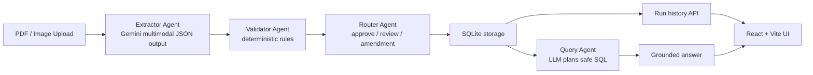

# Technical Write-Up

## Overview

This POC implements an end-to-end trade document workflow using a small agentic backend and a minimal React frontend. The design goal is not maximum abstraction. The design goal is a reviewer-friendly system that shows where AI belongs, where deterministic logic belongs, and how the workflow stays auditable.

## Architecture Diagram

## Implementation Summary

Backend:

- Express API for health, sample listing, run execution, stored-run fetch, and natural-language query
- Gemini integration through `@google/genai`
- deterministic validation and routing
- SQLite persistence for all workflow outputs

Frontend:

- React + Vite single-screen UI
- sample run buttons
- file upload flow
- extracted fields, validation, and decision display
- query box for stored-data questions

## Why This Architecture

The architecture separates unstable, unstructured work from stable policy logic.

- Extraction is model-based because documents are visual and semi-structured.
- Validation is deterministic because business rules should be testable and predictable.
- Routing is deterministic because approval boundaries should be explicit.
- Querying uses the model for planning and summarization, but only after backend SQL safety checks.

This keeps the AI surface focused while preserving a strong trust boundary.

## Three Real Failure Modes

### 1. Missing or low-confidence field extraction

Example:
Incoterms is absent in a low-quality scan or extracted with weak confidence.

Impact:
If treated as complete, the system could approve a shipment without enough evidence.

Current handling:

- extraction carries confidence per field
- validator converts missing or low-confidence fields into `uncertain`
- router blocks approval and escalates the case

### 2. Critical mismatch hidden inside plausible text

Example:
The consignee name is close to the expected value but materially different.

Impact:
A shipment could be processed under the wrong party or commercial terms.

Current handling:

- deterministic rule comparison checks normalized values
- critical fields force `draft_amendment` when not matched
- discrepancy details are preserved in the stored decision

### 3. Natural-language query tries to escape the data boundary

Example:
The model generates unsafe SQL or references nonexistent tables.

Impact:
The system could become untrustworthy or unsafe if query execution were unconstrained.

Current handling:

- SQL must be a single read-only `SELECT`
- forbidden SQL keywords are rejected
- referenced tables are allowlisted
- aggregate and row-listing behavior is normalized before execution

## Observability Plan

For the POC, observability is intentionally lightweight, but the next production step is clear.

Current signals:

- request logging through Morgan
- persisted run data in SQLite
- raw extraction, validation, and decision payloads stored per run
- query history persisted for later inspection

Recommended next layer:

- per-stage latency metrics for extraction, validation, routing, query planning, and query execution
- error counters by failure type
- confidence distribution by field
- amendment rate by customer and document type
- trace IDs flowing from upload through all pipeline stages

## Estimated Cost Per Document

This is an estimate, not a measured billing report.

The main variable cost is the Gemini extraction call. For this POC, validation, routing, and SQLite storage are effectively negligible. Query cost is also small because questions are short and row payloads are bounded.

A reasonable POC framing is:

- extraction: dominant cost
- query planning and summarization: low incremental cost
- storage and API serving: negligible at this scale

Practically, this means one document run should be cheap enough for a demo workload, but cost discipline will matter once volume or document length increases. The first production lever should be model routing by document quality and document type.

## Latency Bottleneck

The main latency bottleneck is the extraction step because it depends on multimodal model inference over PDFs or images.

The rest of the chain is comparatively fast:

- validation is in-memory deterministic logic
- routing is in-memory deterministic logic
- SQLite writes are small
- query execution is local and lightweight

If users report slowness, the extraction call is the first place to instrument and optimize.

## What I Would Improve With One More Week

1. Add a proper eval harness with expected outputs across more clean, messy, and low-quality fixtures.
2. Split prompts by document type so invoices, packing lists, and bills of lading each get tighter extraction instructions.
3. Add explicit reviewer actions in the UI such as mark approved, request correction, and inspect evidence side-by-side with the document.
4. Move from local SQLite to Postgres to support stronger queryability and concurrent usage.
5. Add durable orchestration and retries so long-running or failed extraction steps can recover cleanly.

## Testing Strategy

The codebase now includes deterministic tests for:

- validator clean fixture behavior
- validator messy fixture behavior
- router auto-approve path
- router human-review path
- router amendment path
- query SQL safety and grounded fallback behavior

This keeps the most business-critical logic verifiable without relying on live model calls.

## Production Direction

The current implementation uses custom orchestration because the workflow is short and linear. A production-ready version could map directly to a workflow engine such as LangGraph, Temporal, or a queue-backed job system.

That upgrade would help with:

- retries
- long-running execution
- manual intervention steps
- richer traces and state transitions
- customer-specific branching logic

## Conclusion

The strongest part of this POC is not just that it extracts fields from documents. The stronger technical story is that it creates an auditable decision workflow around those fields. AI is used where ambiguity is unavoidable, and deterministic code is used where business trust matters most.
